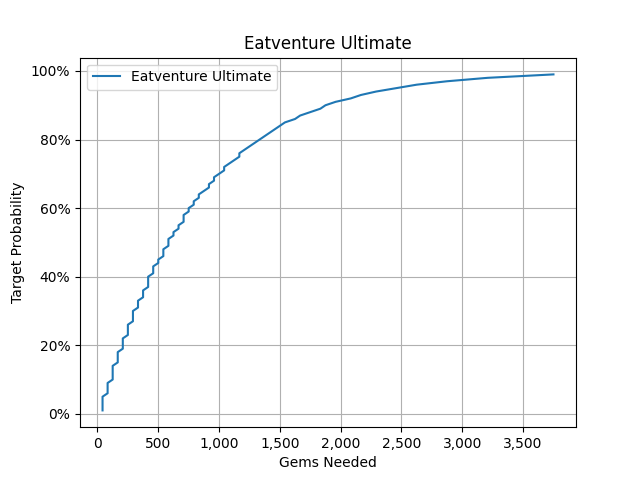

# GeometricDistribution

Explore probability calculations through Python code available in this repository. Featured are three classes and an example file, each with code comments to further explain their functionality.

# Dependencies

This project requires the following Python libraries:

- [Matplotlib](https://matplotlib.org/stable/index.html): Used for creating line charts in the LineChart class.

# ProbabilityCalculator.py:

The ProbabilityCalculator class is designed to assist in probability calculations for Bernoulli trials. It has methods to estimate the number of trials needed to achieve a target probability of at least one success, and to calculate the probability of at least one success in a given number of trials.

# NumberFormatter.py:

The NumberFormatter class is a Python utility for formatting numbers and converting decimal numbers to percentages. It utilizes the locale module to format numbers with thousands separators and provides options for customizing the locale and the number of decimal places in percentage conversion.

# LineChart.py:

The LineChart class is a Python utility for creating line charts using the matplotlib library. It provides methods for customizing the chart's title, labels, data, and formatters for the X and Y axes. You can also save the chart to a file in various formats.

# Example.py:

The example provided is related to the Eatventure mobile game. It is used to caculate how many gems (the premium currency within the game) are needed to aquired a ultimate item (the highest tier of items within the game as of making this). The example code produces the following graph:

